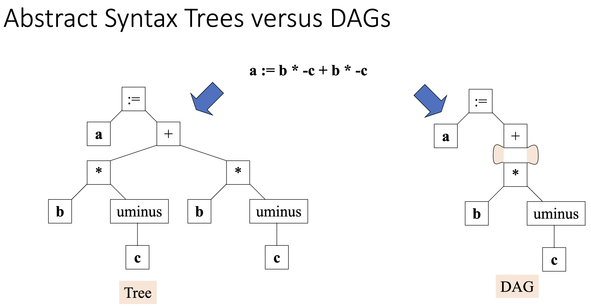
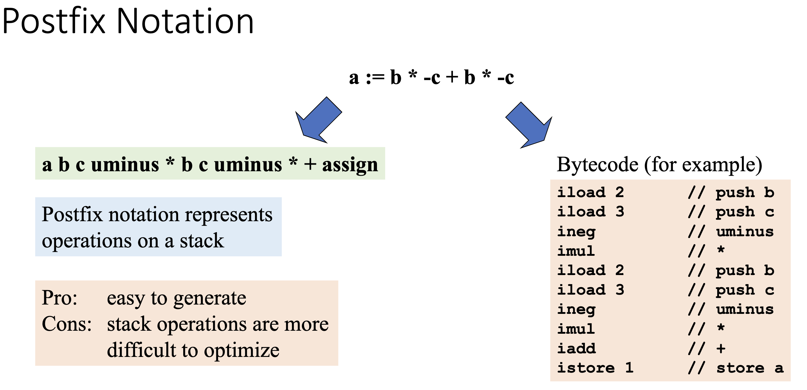
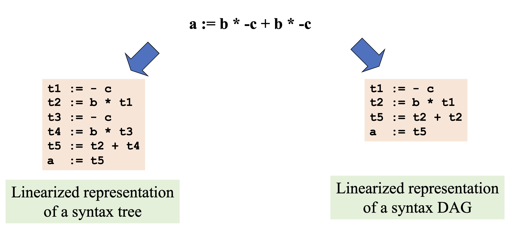
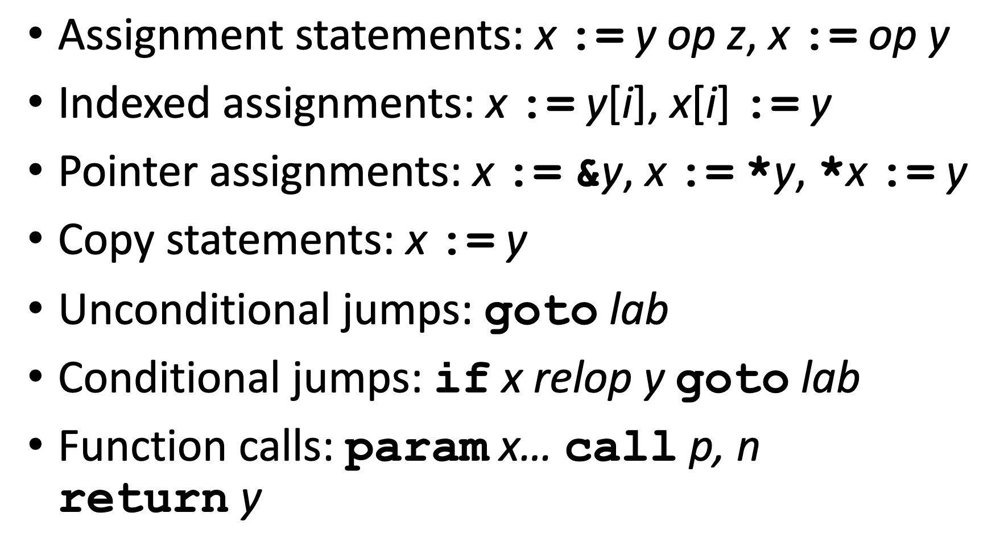

# Intermediate Code Generation

Intermediate Code Generation enables attaching a back end for the new machine to an existing front end. It also enables machine-independent code optimization. 

These include:  
  - Graphical representations (AST)
  - Postfix notation: operations on values stored on operand stack
  - Three-address code: (e.g. triples and quads)   
        x := y op z
  - Two-address code:  
        x := op y  
        which is the same as x := x op y

## Graphical representations
We can represent syntax using Abstract Syntax Trees or Directed Acyclic Graphs:

For ASTs 
  

Pros: 
  - easy restructuring of code
  - expressions for intermediate code optimization  
  
Cons:  
  - memory intensive

## Postfix Noatation

## Three-Address Statements

The following is a list of three-address statements:

