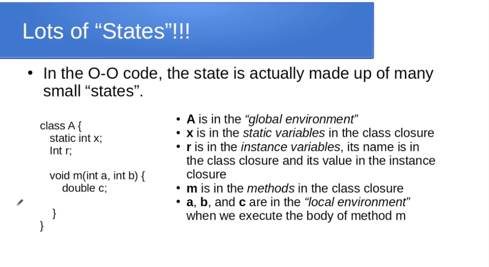

# Object-Oriented Programming
## Author: Rohan Singh

## Java Polymorphism
Each object in Java has two types:  
  - **Compile time type:** This is the type as determined by the compiler. This is the type of the vriable, the return type of the method and for "this" it is the type of the class the code is inside.  
  - **Run time type:** This is the type determined at runtime when the object is created by "new". 

 

The compile time type determines:  
  - Which field is accessed.  
  - Which nested type is accessed.  
  - Which method name/parameter signature is allowed to be accessed.

The run time type determines:
  - Which method body needs to be executed. This is called "dynamic binding" because the binding of the method call name to the method is executed happens at runtime.

**Note:** Fields are determined by the compile time type and the methods are determined by the runtime type.

## Closures

Closures are used to correctly model how an object oriented language works, i.e. mathematical amppings for the class, instance and method.

### Class Closures
Class Closures contain:
  - The super class  
  - The methods  
  - The constructors  
  - The class (static) fields  
  - The instance field names and initial values  
  - Nested types

### Instance Closures
Instance closures contain:
    - The runtime tye of the instance  
    - The value of all the instance fields

### Method Closures
The method closures are similar ot function closures and they contain:
    - The formal parameters + "this" for non-static methods
    - The body of the method
    - A function that returns the portion of the state in scope for the methpd.
    - A function that returns the class closures the method is in (compile time type of "this")

